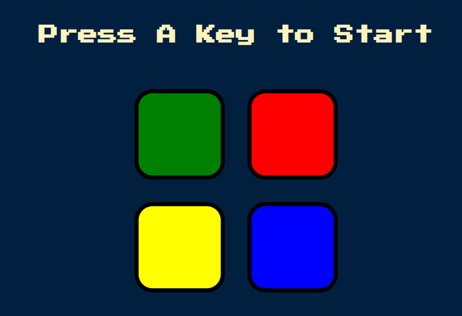

# Basic Simon Game

This is a game that is modeled off the game Simon. So the way that it works is that you can press any key to start and it will show you a tile that you have to click on. And as you go from level to level, the patterns get more and more complicated, and at some point you're going to screw up, and it's going to tell you that you’ve got it wrong and game is over, so you can press any key to restart the game. <b>Just play. Have fun. Enjoy the game.</b>



## Getting Started

Start by cloning the repo : 
```sh
git clone https://github.com/dishantagg24/basic-simon-game
```
Or Download and extract the zip file.
### Prerequisites

* A modern-web browser like Brave , Chrome , Firefox etc
* Computer..
* At last, Just you and your will....


### Running

1. Double-Click on index.html file or Open it with your favourite browser.

## Built With

* [Javascript](https://www.javascript.com/) - High-level, interpreted programming language
* [HTML](https://www.html.com/) - Standard markup language
* [CSS](https://css.com) - Style sheet language

## Authors

* **[Dishant Aggarwal](https://github.com/dishantagg24)**

## License

This project is licensed under the MIT License - see the [LICENSE.md](https://github.com/dishantagg24/basic-simon-game/blob/master/LICENSE) file for details

## Acknowledgments

* https://www.udemy.com/course/the-complete-web-development-bootcamp/
